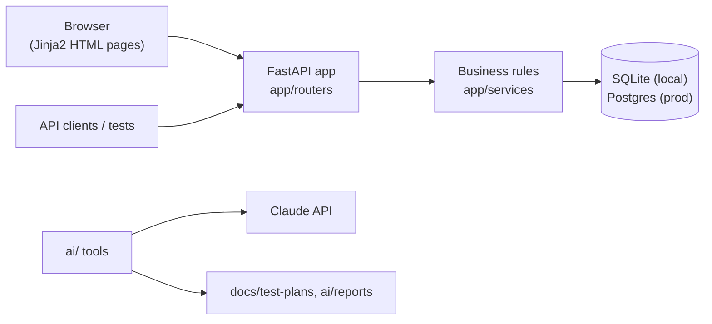

# Her Aura

A personal health record for women: it keeps your whole health history in one place, tells you **when** to see a doctor
and **which** specialist, lets you book them, and supports your cycle, sleep and mind. Built as a **QA engineering portfolio project**: the testing around it is the point.

- Log any health issue (headache, toothache, skin rash, hair fall, tiredness, fever, stomach, joint pain, low mood...) with severity and notes
- Rule-based suggestions: severe → "see a doctor soon", recurring → the right specialist, several general symptoms → general checkup, plus lifestyle tips. Every suggestion says why. **It never diagnoses.**
- Find doctors by specialty, call the clinic, book and cancel appointments
- **Cycle + temperature:** symptom counter based on the Goff index; basal body temperature with after-the-fact ovulation confirmation (3-over-6 rule). **Not a contraceptive**, and the app says so wherever temperatures appear
- **Sleep:** nightly log, 7-night averages, wind-down routines, a heads-up in the pre-period week
- **Mind:** a 7-day beginner mindfulness programme that unlocks day by day
- **Emotional load:** daily check-in on mood, stress, energy and the invisible work you carry, 14-day patterns, hand-off tips, stress by cycle phase, crisis support always visible
- **Learn:** 10 featured women's health articles (WHO, NHS, ACOG) free for everyone; a premium library unlocked by subscription or a short rewarded ad. Safety guides are never paywalled, and ads never use health data
- Coming next: runs/rides/outdoor workouts, nutrition, doctor reviews, an AI health assistant. Long-term vision: certified digital contraception (see the [regulatory path](docs/ROADMAP.md))
- Every health claim is checked against research: [docs/RESEARCH.md](docs/RESEARCH.md). Hosting guide: [docs/HOSTING.md](docs/HOSTING.md)

> Her Aura is not a medical device. All doctors and clinics in the demo data are fictional.

## What this repo demonstrates

| Skill | Where |
|---|---|
| Requirement analysis (user stories, ACs, open questions) | [docs/REQUIREMENTS.md](docs/REQUIREMENTS.md) |
| Test strategy, pyramid, AC → test traceability | [docs/TEST_STRATEGY.md](docs/TEST_STRATEGY.md) |
| UI automation: Playwright + TypeScript, Page Object Model with inheritance, components, fixtures, Faker | [e2e/](e2e) |
| API testing with pytest | [tests/api](tests/api) |
| SQL data-integrity checks (joins, anti-joins, GROUP BY/HAVING) | [tests/db](tests/db) |
| Boundary / state-transition / concurrency testing | [tests/unit](tests/unit), [app/services/scheduling.py](app/services/scheduling.py) |
| Agentic QA: LLM test planning, AI failure triage, Playwright agents | [ai/](ai) |
| CI/CD: GitHub Actions, reports as artifacts, secret scanning | [.github/workflows/ci.yml](.github/workflows/ci.yml) |

## Architecture



## Run it

```bash
python -m venv .venv
.venv\Scripts\activate          # macOS/Linux: source .venv/bin/activate
pip install -r requirements-dev.txt
uvicorn app.main:app --reload   # http://127.0.0.1:8000
```

## Test it

```bash
pytest                          # unit + API + DB tests

cd e2e
npm install
npx playwright install chromium
npx playwright test             # starts the app automatically
npx playwright show-report
```

## Project layout

```
app/          FastAPI app: models, routers (api + pages), services (business rules), templates
tests/        pytest: unit/, api/, db/
e2e/          Playwright: pages/ (POM), components/, fixtures/, tests/, utils/
ai/           test_planner.py, failure_triage.py, prompts/
docs/         REQUIREMENTS, TEST_STRATEGY, ROADMAP
STATUS.md     incremental status log
```

## Roadmap
Fitness and nutrition tracking, doctor reviews, hospitals by specialty, an AI health assistant (with evals and guardrails), a React Native app with Appium tests. See [docs/ROADMAP.md](docs/ROADMAP.md).
