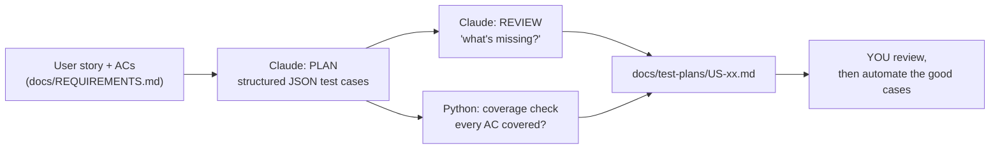
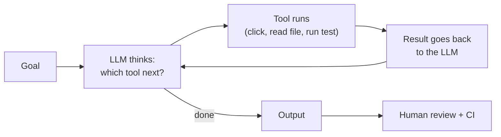

# Agentic QA in Her Aura

Three ways AI helps testing here, from simplest to most "agentic". All of them keep a human in charge.

## 1. LLM-based test planning (`test_planner.py`)

```bash
export ANTHROPIC_API_KEY=...      # never commit this
python -m ai.test_planner US-05
```
Key ideas: structured output (Pydantic schema), a second "critic" call, and a deterministic check that doesn't trust the model.

## 2. Failure triage agent (`failure_triage.py`)
Reads `e2e/test-results/results.json`, sends each failure + the spec + page objects to Claude, and writes a report:
category (app bug / locator / timing / data / environment), evidence, suggested fix, how to verify.
**It never edits code.**
```bash
cd e2e && npx playwright test ; cd ..
python -m ai.failure_triage
```

## 3. Playwright's built-in agents (planner / generator / healer)
These are real agents: they drive a browser through MCP tools in a loop.
```bash
cd e2e
npx playwright init-agents --loop=claude    # adds agent definitions for Claude Code
```
Then ask Claude Code: "Use the planner agent to explore http://127.0.0.1:8000 and plan tests for booking".
Compare what it generates with the hand-written page objects. Keep what's good, fix what isn't, and write down the differences (great interview material).

## The agent loop (explain this in interviews)


## Model and cost
Model is set by `HERAURA_AI_MODEL` (default `claude-opus-5-5`). `ai/llm.py` enables Anthropic's server-side
fallback (`fallbacks="default"`), so a safety refusal is retried on another model automatically. Each run costs a few cents.
