# Her Aura: Knowledge Base

Everything about Her Aura in one place: the business case, requirements, architecture, every technology and why it was chosen,
the test strategy with real test cases, the AI agents, the hard problems solved, and how to explain all of it in an interview.

> Diagrams are written in Mermaid and render on GitHub. Numbers are as of October 2026.

**Contents**
1. [Pitch: 30 seconds, 2 minutes, 10 minutes](#1-pitch)
2. [Business case](#2-business-case)
3. [Requirement analysis (RAD)](#3-requirement-analysis-rad)
4. [Architecture and technology](#4-architecture-and-technology)
5. [Data model](#5-data-model)
6. [Key flows, step by step](#6-key-flows)
7. [Test strategy and test cases](#7-test-strategy-and-test-cases)
8. [CI/CD and deployment](#8-cicd-and-deployment)
9. [AI and agents](#9-ai-and-agents)
10. [Real problems found and decisions made](#10-real-problems-found-and-decisions-made)
11. [Interview questions about this project](#11-interview-questions-about-this-project)
12. [Own-it checklist](#12-own-it-checklist)
13. [Glossary](#13-glossary)

---

## 1. Pitch

**30 seconds.** Her Aura is a women's health record: you log any health issue, it tells you when to see a doctor and which specialist,
and you can book one. It also supports the cycle, sleep, mindfulness and emotional load. I built it as a QA portfolio project, so the
interesting part is the testing: about 170 pytest tests across unit, API and SQL layers, 56 Playwright end-to-end runs on desktop and
mobile, requirement-to-test traceability, AI agents for test planning and failure triage, and CI on every pull request.

**2 minutes.** Add: the problem (scattered health history, people don't know which specialist to see), three things you're proud of
(the 10-thread double-booking race test that I proved catches the bug, the safety decisions like refusing to market it as
contraception, and the AI agents with deterministic checks), and one bug you found (the health-check endpoint shadowed by a page).

**10 minutes.** Walk the architecture diagram (§4), one flow (§6.1 booking), the test pyramid (§7.1), and one agent (§9.1).

---

## 2. Business case

### 2.1 Problem
- People's health history is scattered: a headache in March, a rash in June, hair fall for months. Nobody connects the dots.
- When something keeps coming back, people don't know **when** it's worth a doctor or **which** specialist.
- Women's health apps focus on periods only; cycle, sleep, mood and general symptoms affect each other.

### 2.2 Users (personas)
| Persona | Need | What Her Aura gives |
|---|---|---|
| Working woman, 28, Dhaka | Quick logging, knows something's off but not what | One-tap logs, "see a doctor soon / which specialist" with reasons |
| Woman tracking her cycle naturally | Understand ovulation and the pre-period week | Basal temperature confirmation (after the fact), sleep and mood tips by phase |
| Caregiver carrying the "mental load" | Notice burnout early | Emotional-load check-ins, top load areas, hand-off tips, crisis line |

### 2.3 Value proposition
"Your health history in one place. Know when to see a doctor, and which one." Every suggestion explains **why** (which logs triggered it).

### 2.4 Market scan (competitors studied)
Clue (period tracking), Natural Cycles (FDA-cleared digital contraceptive), MyFitnessPal and Cronometer (nutrition), Strava (endurance and
community), Nike Training Club (workouts), Oura (sleep), Headspace (mindfulness), Calm (sleep), Solu (cycle-aware all-in-one), Belle
(mental health as part of hormonal health). Her Aura combines general symptoms + cycle + mind with doctor booking. Sources: `docs/RESEARCH.md`.

### 2.5 Monetization
| Plan | Includes |
|---|---|
| Free | All tracking, suggestions, booking, 10 featured articles, **all safety content** |
| Premium | Full article library, no ads |
| Rewarded ads | Free users unlock 1 library article for 24 h by watching a short ad, up to 3 per day |

Ads are contextual (article topic) only, never targeted using health data. Reason: the US FTC acted against a period app (Flo, 2021)
for sharing health data with advertisers.

### 2.6 Safety, privacy and regulatory position
- **Not a medical device; never diagnoses.** Suggestions say "see a doctor", never "you have X".
- **Not a contraceptive.** Temperature tracking confirms ovulation only after it happened; "safe days" are never shown. A real
  contraceptive app is an FDA Class II device (Natural Cycles' path). That's on the roadmap as a regulated long-term goal.
- **Privacy:** every user sees only their own data (tested), passwords hashed, secrets never in the repo (gitleaks).
- **No fake trust signals:** no invented badges or testimonials; demo doctors are labelled fictional (tested).

### 2.7 Risks
Medical misinformation (mitigated: rules from published research, disclaimers, emergency info), privacy breach (access-control tests,
no ad targeting), user over-trust in suggestions (explanations + "not a diagnosis"), regulatory (no contraception claims).

---

## 3. Requirement analysis (RAD)

### 3.1 Scope
**In:** accounts, health-issue log, specialist suggestions, doctors and booking, cycle + temperature, sleep, mindfulness, emotional load,
articles + monetization, landing page demo. **Out (planned):** doctor portal, referrals, maps, reminders, fitness, nutrition, reviews,
AI assistant, mobile app, data deletion. Full list: `docs/REQUIREMENTS.md` (32 user stories).

### 3.2 Stakeholders
Patients (end users), doctors/clinics (booking supply), product owner (scope, monetization), compliance (privacy, medical claims), QA (me).

### 3.3 Epics and stories (status)
| Epic | Stories | Status |
|---|---|---|
| Accounts | US-01 register, US-02 login/out | Done |
| Health record | US-16 any health issue, US-03 cycle log, US-13 same as yesterday, US-15 one-tap UI | Done |
| Guidance | US-17 which doctor and when, US-04 red-flag counter, US-25 basal temperature | Done |
| Care access | US-05 book, US-06 cancel, US-18 doctors by specialty + call | Done |
| Wellbeing | US-26 sleep, US-27 mindfulness, US-32 emotional load | Done |
| Content & revenue | US-30 articles, US-31 premium + rewarded ads, US-24 landing demo | Done |
| Future | US-07..12, US-14, US-19..23, US-28, US-29 | Planned |

### 3.4 Business rules catalogue (every number the app depends on)
| Rule | Value | Source of the number | Where tested |
|---|---|---|---|
| Red-flag counter (Goff index) | pain, bloating or early fullness on **≥12 of last 30 days** | Goff et al., 2007 | `test_health_insights.py` (11 vs 12, day 29 vs 30, leap day) |
| See a doctor soon | severity **≥8** within the last **3 days** | product decision | `test_health_suggestions.py` (7/8/10; age 2 vs 3) |
| Recurring → specialist | same issue on **≥4 different days in 14** | product decision | (3 vs 4 days; same-day duplicates count once) |
| General checkup | **≥3** different general symptoms in 14 days | product decision | `test_general_symptom_pattern_suggests_checkup` |
| Ovulation confirmed (3-over-6) | 3 consecutive readings above previous 6, third **≥0.2 °C** above their max | Marshall, 1968 | `test_cycle.py` (0.19 vs 0.2, missing day, 2 vs 3 highs) |
| Pre-period week | **1-7 days** before expected period | product decision | `test_late_luteal_window` (0, 1, 7, 8) |
| Cancel cut-off | **≥2 hours** before the appointment | product decision | `test_cannot_cancel_within_two_hours` |
| One booking per slot | exactly **1** winner under concurrency | business integrity | `test_concurrent_booking.py` (10 threads) |
| Rewarded ad | watch **15 s**, unlock **24 h**, max **3/day** | product decision | `test_articles.py` (14.9 vs 15 s; 2 vs 3/day) |
| Low-mood support | mood **≤2** on **≥10 of 14** days | mirrors "most days for two weeks" | `test_emotional_load.py` (9 vs 10) |
| High stress | stress **≥7** on **≥5** days | product decision | (6 vs 7) |
| Input ranges | severity 1-10, pain 0-10, temp 35.0-38.5 °C, sleep 0-24 h, quality 1-5 | validation | API tests (each boundary) |

### 3.5 Non-functional requirements
| Area | Requirement | Evidence |
|---|---|---|
| Privacy / access control | users only see their own data | "private" tests in every API test file |
| Security | hashed passwords (PBKDF2), generic login errors, secrets scanned | `test_password_is_stored_hashed`, gitleaks in CI |
| Integrity | no double booking even under concurrency | atomic UPDATE + race test |
| Usability | one-tap chips, number inputs, mobile viewport | Playwright mobile project |
| Reliability | health check for the host | `/healthz` + regression test |
| Honesty | disclaimers, emergency info and "not a contraceptive" always visible | UI tests assert they're present |

### 3.6 Assumptions, open questions, risks
Assumptions: users can read English; demo data is fictional. Open: languages (Bangla), data-deletion policy, real payment provider.
Risks: see §2.7.

---

## 4. Architecture and technology

### 4.1 System diagram
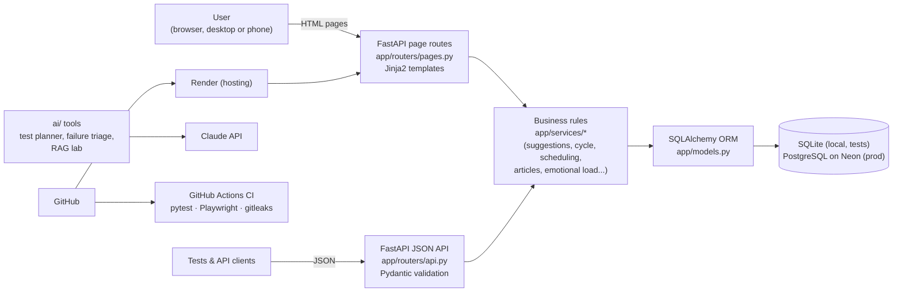
**Why this shape:** pages and the API share the **same service layer**, so the rules are written once and tested once at the cheapest
layer (unit/API), while the UI tests only check what users see.

### 4.2 Technology and why
| Layer | Technology | Why I chose it |
|---|---|---|
| Language (app) | Python 3.12+ | readable, same language as the API tests |
| Web framework | FastAPI | automatic validation (Pydantic), automatic OpenAPI spec at `/openapi.json`, fast |
| Templates | Jinja2 + plain CSS/JS | no frontend build step; stable ids/test-ids for automation |
| Validation | Pydantic | request rules (ranges, enums) in one place; returns 422 automatically |
| ORM | SQLAlchemy 2 | same code on SQLite and Postgres; constraints (UNIQUE) at DB level |
| Database | SQLite locally, PostgreSQL (Neon) in production | zero setup for dev/tests; managed Postgres for real use |
| Auth | session cookie (Starlette), PBKDF2 hashing | simple, standard library hashing |
| Unit/API/DB tests | pytest, FastAPI TestClient, raw SQL | fast, readable, fixtures for fresh DB per test |
| UI tests | Playwright + TypeScript, Page Object Model, Faker | auto-waiting, traces, mobile emulation, typed page objects |
| CI | GitHub Actions | runs everything on every PR, uploads reports |
| Security in CI | gitleaks | blocks committed secrets |
| Hosting | Render (app) + Neon (Postgres) | free tiers, deploy from GitHub with `render.yaml` |
| AI | Claude API (Anthropic SDK), structured outputs | test planning, failure triage, RAG lab |

### 4.3 Folder map
```
app/            routers (pages, api), services (business rules), models, schemas, templates, static
tests/          unit/ (pure rules)  api/ (endpoints)  db/ (SQL integrity, concurrency)
e2e/            Playwright: pages/ (POM), components/, fixtures/, tests/, utils/
ai/             test_planner.py, failure_triage.py, llm.py, prompts/, rag_lab/
docs/           REQUIREMENTS, TEST_STRATEGY, RESEARCH, ROADMAP, HOSTING, EXERCISES, this file
.github/        CI workflow        render.yaml   deploy blueprint
```

---

## 5. Data model
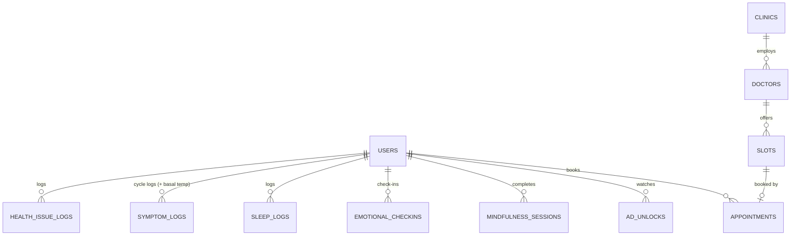
**Constraints worth mentioning:** UNIQUE (user, date) on cycle, sleep and emotional logs (one per day); UNIQUE (user, program_day) on
mindfulness; UNIQUE (doctor, starts_at) on slots; `is_booked` flipped atomically when booking.

---

## 6. Key flows

### 6.1 Booking without double booking
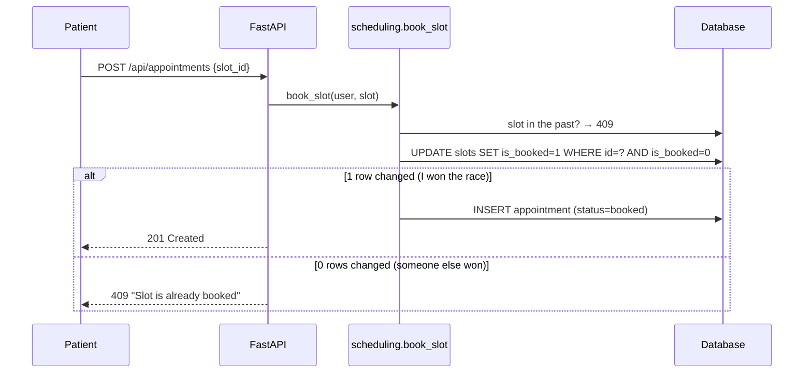
**Interview point:** the check and the claim happen in **one** SQL statement, so two people can't both pass the check. I proved the test
works by removing the guard: 10 threads all "booked" the same slot; with the guard, exactly 1 wins.

### 6.2 "Which doctor, and when?" (suggestion engine)
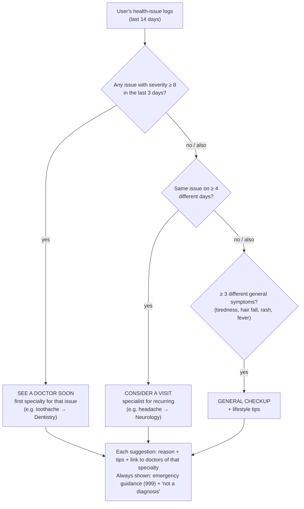

### 6.3 Ovulation confirmation (3-over-6)
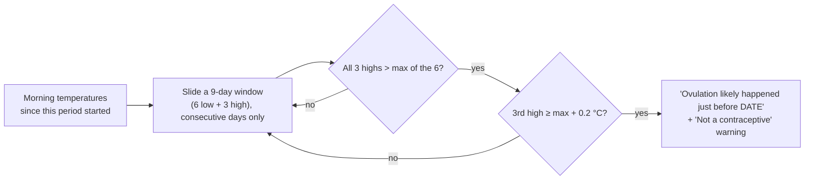

### 6.4 Rewarded ad unlock (server-enforced)
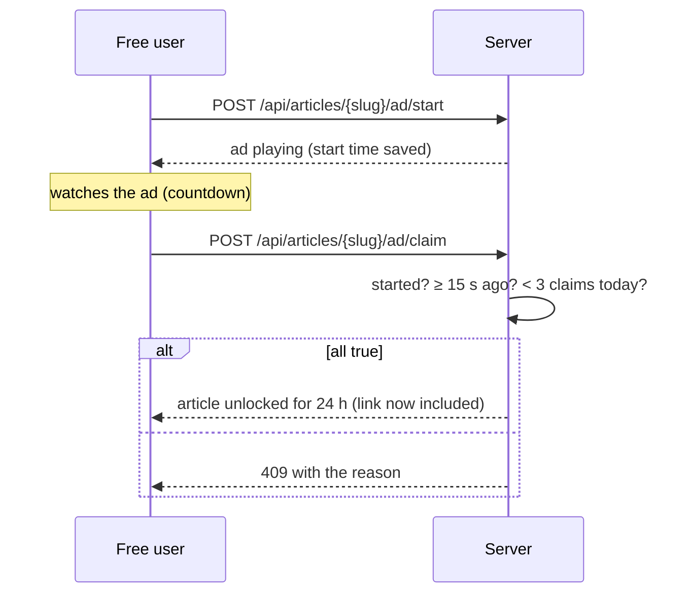
**Interview point:** the timer is checked on the **server**, so editing the page's countdown doesn't help; locked links are never sent.

### 6.5 RAG lab
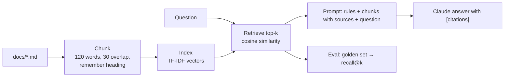

---

## 7. Test strategy and test cases

### 7.1 Pyramid and numbers
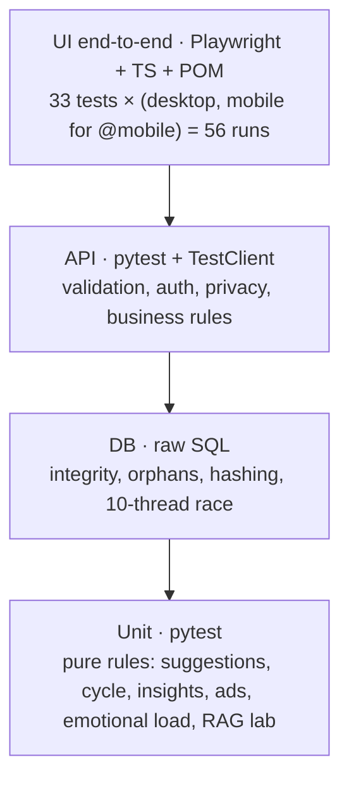
About **170 pytest tests** + **56 Playwright runs**, all in CI on every pull request. Rule: test each behaviour at the **lowest layer that
can prove it**; UI tests only for what a user must see or do.

### 7.2 Techniques used (with real examples)
| Technique | Example in Her Aura |
|---|---|
| Boundary values | red flag 11 vs 12 days; pain −1/0/10/11; ad 14.9 vs 15 s; cancel 1 h vs 2 h; temp 34.9/35.0/38.5/38.6 |
| Equivalence partitioning | valid vs invalid emails, flow values, issue categories |
| State transition | slot open → booked → cancelled → open; mindfulness day locked → current → done |
| Decision table | article unlocked? = tier × safety × plan × ad-unlocked (5-row parametrized test) |
| Concurrency | 10 threads booking one slot |
| Security / access control | another user's logs, sleep, check-ins, appointments return nothing |
| Negative | future dates, unknown categories, duplicates (409) |
| Mutation check | broke the booking guard on purpose; the race test failed (10 bookings), proving it works |

### 7.3 Representative test cases
| ID | Story | Technique | Steps | Expected |
|---|---|---|---|---|
| TC-01 | US-01 | EP | Register with an email already used, different letter case | "already registered", no second user |
| TC-02 | US-02 | Security | Wrong password; then unknown email | Same generic error both times |
| TC-03 | US-03 | Boundary | Log pain −1, 0, 10, 11 | 422, 201, 201, 422 |
| TC-04 | US-03 | Negative | Log tomorrow's date | Rejected (browser blocks + server 422) |
| TC-05 | US-04 | Boundary | 11 then 12 symptom days in 30 | No warning, then warning + gynecologist link |
| TC-06 | US-05 | Concurrency | 10 patients book one slot at once | Exactly 1 booked, 9 rejected, 1 row in DB |
| TC-07 | US-06 | Boundary | Cancel 1 h before vs 3 h before | 409 vs cancelled + slot reopened |
| TC-08 | US-13 | State | "Same as yesterday" with yesterday logged / not logged / today already logged | copies (no notes, no temp) / error / 409 |
| TC-09 | US-17 | Boundary | Toothache severity 7 vs 8 | No suggestion vs "See a doctor soon: Dentistry" |
| TC-10 | US-17 | Rule | Headache on 3 vs 4 different days (2 logs same day count once) | No suggestion vs Neurology |
| TC-11 | US-25 | Boundary | 3-over-6 with third high 0.19 vs 0.20 °C above | Not confirmed vs confirmed |
| TC-12 | US-25 | Negative | Missing one morning inside the window | Not confirmed (gap breaks sequence) |
| TC-13 | US-31 | Security | Free user requests a premium article | 402, link never in response |
| TC-14 | US-31 | Boundary | Claim ad at 14.9 s vs 15 s; 4th claim in a day | Rejected vs unlocked; 4th rejected |
| TC-15 | US-32 | Boundary | Low mood on 9 vs 10 of 14 days | No professional suggestion vs suggestion first |
| TC-16 | US-24 | Integrity | Landing demo request | Uses the same rules as the app; nothing saved in DB |
| TC-17 | NFR | Regression | GET /healthz | 200 {"status":"ok"} (not shadowed by a page) |

Full traceability (every acceptance criterion → test): `docs/TEST_STRATEGY.md`.

### 7.4 UI automation design (Page Object Model)
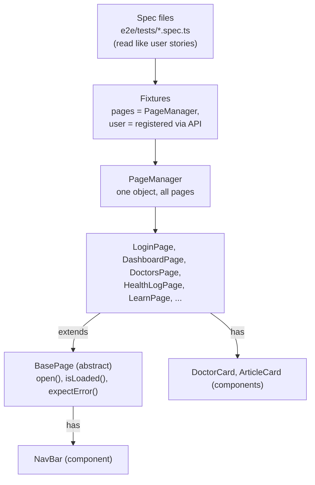
**Choices to explain:** test data created through the **API** in a fixture (fast, independent tests); stable `id`/`data-testid` locators;
web-first assertions, no fixed waits; booking specs run serially because they share seeded slots; mobile viewport project for
`@mobile` suites.

### 7.5 Flaky-test policy
No sleeps; unique data per test (Faker); find the root cause before retrying; retries only in CI as a safety net.

---

## 8. CI/CD and deployment
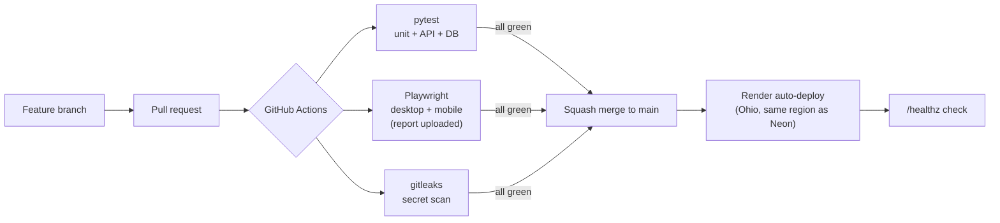
Git practices: one branch per change, Conventional Commits (`feat:`, `fix:`, `test:`), squash merge, `.gitignore` for databases/venv/
node_modules, gitleaks pre-commit hook.

---

## 9. AI and agents

| Tool | What it does | How it stays trustworthy |
|---|---|---|
| **Test planner** `ai/test_planner.py` | User story → test cases (JSON), then a **reviewer** pass lists gaps | Structured output (schema); **plain-code check** that every acceptance criterion is covered; human approves |
| **Failure triage** `ai/failure_triage.py` | Reads the Playwright JSON report, sends error + spec + page objects to Claude, writes a diagnosis | Never edits code; must quote evidence; "low confidence" allowed |
| **RAG lab** `ai/rag_lab/` | Retrieval over the project docs + grounded prompt with citations | Golden set, recall@k baseline, unit tests |
| **Playwright agents** | Official planner/generator/healer agents can explore the app | Output compared with hand-written page objects |
| **AI pair programming** | The project was built with an AI coding assistant (Claude Code) under my direction | I wrote the requirements and decisions, reviewed every change, ran and fixed the tests |

### 9.1 Test planner flow
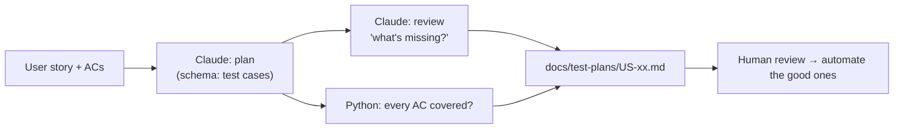

### 9.2 Planned: multi-agent requirement pipeline
Business idea → Business Analyst agent → Requirements Reviewer (≤2 rounds) → **human approval** → Test Designer → Test Reviewer →
plain-code coverage check → **human approval** → PR with requirements, test plans and traceability.

**Honest interview line:** "I use AI agents to go faster, and I design them so they can be checked: fixed output formats, code-based
coverage checks, evidence requirements, and a human approval step. I can explain and change every part."

---

## 10. Real problems found and decisions made

Use these as STAR stories (Situation, Task, Action, Result).

| # | Situation | Action | Result |
|---|---|---|---|
| 1 | The double-booking test passed, but would it catch a real bug? | Removed the atomic guard on purpose and re-ran it | 10 of 10 threads booked the same slot: the test fails without the guard, so it's real. Guard restored |
| 2 | `/health` returned a redirect instead of `{"status":"ok"}` | Traced it: the "Log health" page used the same URL and won | Moved to `/healthz`, updated Render + Playwright config, added a regression test |
| 3 | Requirement said "digital contraceptive with clinical accuracy" | Researched: that's an FDA Class II device with a 22,785-woman study | Built after-the-fact confirmation + warnings; contraception kept as a regulated roadmap goal |
| 4 | Feedback asked for "256-bit encryption" badges and testimonials | Checked: none were true | Refused fake trust signals; added a test that only true statements appear |
| 5 | A search question failed in the RAG lab ("Postgres hosted") | Diagnosed vocabulary mismatch with the eval tool | Turned into a measured improvement task (query rewriting / embeddings) |
| 6 | A schema change broke the running local app | Recognised `create_all` doesn't alter existing tables | Planned Alembic migrations (exercise D2) and documented it in hosting notes |
| 7 | Windows saved files in the wrong encoding (`°` broke Python) | Found the cause (default cp1252) | Repaired files, always write UTF-8, added console encoding fix |

---

## 11. Interview questions about this project

1. **Why FastAPI and not Django/Flask?** Validation and API docs for free (Pydantic, OpenAPI), fast, small; pages and API share services.
2. **How do you prevent double booking?** One atomic `UPDATE ... WHERE is_booked = 0`; check the affected row count; race test with 10 threads; mutation-checked.
3. **Why so few UI tests compared with API tests?** Pyramid: rules are proven at unit/API level (fast, stable); UI tests cover journeys and what users must see.
4. **How do your UI tests get data?** A fixture registers a fresh Faker user via the API, and the browser shares the session cookie.
5. **How do you keep tests from being flaky?** Web-first assertions, unique data, isolation, serial only where data is shared, traces on failure.
6. **How do you know your tests cover the requirements?** Every AC maps to tests in the traceability table; the AI planner's coverage check is plain code.
7. **What's the riskiest feature and how did you test it?** Health guidance: boundary tests on every threshold, disclaimers asserted in UI, no diagnosis wording.
8. **How do you handle privacy?** Per-user filtering in every query, "can't see another user's data" tests on each resource, no health data to ads.
9. **How is it deployed?** GitHub → Actions (pytest, Playwright, gitleaks) → merge → Render auto-deploy, Postgres on Neon, `/healthz` check.
10. **Where did you use AI, and how do you trust it?** Planner, reviewer, triage, RAG; schemas, code checks, evidence, human approval.
11. **What would you do next?** Alembic migrations, API contract agent from `/openapi.json`, Postgres in CI, accessibility tests, performance test with k6.
12. **What was the hardest bug?** Pick from §10 (the shadowed health check is a great 1-minute story).

---

## 12. Own-it checklist

You're "technically sound" on this project when you can do each item **without notes and without AI**. Tick them honestly.

**Read and explain (week 1-2)**
- [ ] Draw §4.1 from memory and explain each box in one sentence
- [ ] Open `app/services/scheduling.py` and explain every line of `book_slot`
- [ ] Open `app/services/health_suggestions.py` and walk §6.2 with real code
- [ ] Open `e2e/pages/BasePage.ts`, `AuthPages.ts`, `fixtures/test.ts`: explain inheritance, fixtures, POM
- [ ] Read `.github/workflows/ci.yml` and explain each step

**Change it (week 2-4)**
- [ ] Change a rule (e.g. recurring threshold 4 → 5); predict which tests fail; run them; revert
- [ ] Add a field (e.g. "duration_days") end to end: model → schema → API → template → test
- [ ] Write the missing test US-06 AC3 yourself; open a PR
- [ ] Write one new Playwright spec using existing page objects

**Rebuild small pieces from scratch (week 4-6)**
- [ ] Write `book_slot` again in a blank file, then compare
- [ ] Write a page object + spec for a new page without looking
- [ ] Write the 3-over-6 function from the rule text in §3.4, then run the existing tests against it

**Explain under pressure (every week)**
- [ ] 30-second and 2-minute pitch, recorded
- [ ] Answer §11 aloud; have Claude grade you

---

## 13. Glossary
**ORM** maps tables to classes · **Pydantic** validates request data · **TestClient** calls the API in-process · **Fixture** setup/teardown
for tests · **POM** one class per page · **Web-first assertion** retries until true · **Atomic** happens fully or not at all ·
**Race condition** two actions at once interfere · **Mutation check** break the code to prove the test catches it · **CI** automatic
build and test on every change · **RAG** retrieve your documents into the prompt · **recall@k** right source in the top k ·
**Traceability** requirement ↔ test mapping · **Boundary value** test at the edges
