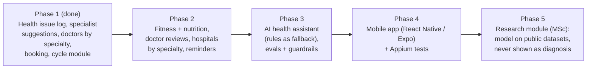

# Roadmap

Big vision, small steps. Each phase ships something that works and is tested.

## Phase 2: Health platform
- Fitness/gym records and goals (US-19), nutrition and calories (US-20), doctor reviews (US-21), hospitals by specialty (US-22)
- Roles: patient, doctor, admin (role-based access tests!)
- Doctor portal: publish slots, see upcoming patients, mark completed
- Referrals: doctor → specialist, statuses (sent, accepted, completed), audit trail
- Nearby clinics: OpenStreetMap + distance sort
- Checkup reminders (email)
- Delete my data (GDPR-style)
- Calendar heatmap of symptom severity (US-14); opt-in daily log reminders (US-11)
- Hosting (free tiers change often, check before you sign up):
  - App: **Render** free web service (sleeps when idle; first request is slow). Koyeb also has a small free instance.
  - Database: **Neon** (free Postgres, database branching is handy for test runs) or **Supabase** (free projects pause after a period of inactivity).
  - Avoid Render's free Postgres for anything you keep: free databases there expire after a limited time.
  - Fly.io no longer has a general free tier for new accounts. PythonAnywhere is built for WSGI apps (Flask/Django), not FastAPI's ASGI.
  - CI: GitHub Actions is free with unlimited minutes for **public** repos (the 2,000 min/month limit applies to private repos).

## Phase 3: AI features (product)
- Doctor-visit summary PDF from the last 3 months of logs
- Test it like an AI tester: factual consistency with logs, no diagnosis words, prompt injection in notes field, consistency across runs
- Eval suite with promptfoo or DeepEval

## Phase 4: Mobile
- React Native (Expo) app on the same API
- Appium + UiAutomator2 tests on an Android emulator, page objects shared in spirit with the web suite

## Phase 5: Research (MSc tie-in)
- Train/evaluate a model on public ovarian research datasets with explainability (XAI), as in your colorectal cancer paper
- Lives in a separate `research/` folder. Its output is never shown to app users as a probability or diagnosis.

## Safety and privacy rules (all phases)
- The app does not diagnose and never shows a "chance of cancer".
- Minimum data, encrypted in transit, deletable on request. No real patient data in tests.

## Regulatory path: digital contraception (long-term vision)
A contraceptive app is a **medical device**. The precedent: Natural Cycles, FDA De Novo **Class II** (2018), with a study of 22,785 women
showing 93% typical-use effectiveness. Before Her Aura could ever claim contraception, it would need:
1. A quality management system (ISO 13485) and software lifecycle process (IEC 62304), plus risk management (ISO 14971)
2. A validated algorithm and a clinical study measuring Pearl Index / typical-use failure rate
3. Clearance per market: FDA (US), CE marking under EU MDR (Europe), and local regulators elsewhere
4. Post-market surveillance: monitoring real-world pregnancies and complaints

Until then, Her Aura confirms ovulation after the fact only, and says clearly it is not a contraceptive (tested in US-25 AC4).
For a QA engineer this is a strong interview topic: testing in regulated software (traceability, validation, audit trails).
