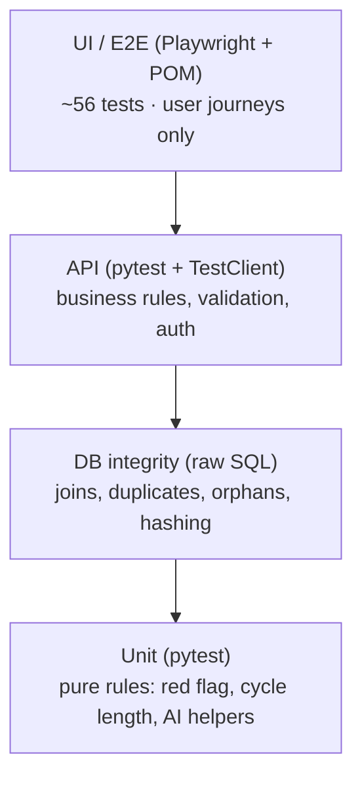

# Test Strategy

## Goals
1. Every acceptance criterion has an automated test (traceability below).
2. Test each rule at the **lowest layer** that can prove it: fast, stable, cheap.
3. Health data is sensitive: privacy and "never a diagnosis" are tested like features.

## Test pyramid

| Layer | Tool | Location | Runs in CI |
|---|---|---|---|
| Unit | pytest | `tests/unit` | Every push |
| API | pytest + FastAPI TestClient | `tests/api` | Every push |
| DB | pytest + SQL | `tests/db` | Every push |
| UI (desktop + mobile viewport) | Playwright TypeScript, Page Object Model | `e2e/` | Every push |
| AI-assisted planning | Claude + deterministic coverage check | `ai/test_planner.py` | On demand |
| AI failure triage | Claude, human-reviewed | `ai/failure_triage.py` | On demand after failures |

## Techniques used
- **Boundary values:** red flag at 11 vs 12 days; pain -1 / 0 / 10 / 11; cancel at 1h vs 2h before.
- **Equivalence partitioning:** valid/invalid emails, flow values.
- **State transition:** slot open → booked → cancelled → open.
- **Concurrency:** double booking prevented by an atomic update (`app/services/scheduling.py`), tested with 10 simultaneous threads.
- **Mutation check:** when a test guards a critical rule, break the rule on purpose and confirm the test fails (done for the double-booking guard).
- **Security/privacy:** users can't read each other's data; passwords hashed; generic login errors.

## Traceability

| AC | Test(s) |
|---|---|
| US-01 AC1 | `e2e/tests/auth.spec.ts` "new user can register", `tests/api/test_auth_api.py::test_register_logs_user_in` |
| US-01 AC2 | `auth.spec.ts` "duplicate email", `test_duplicate_email_is_rejected_case_insensitively` |
| US-01 AC3 | `test_register_validation` (3 cases) |
| US-01 AC4 | `tests/db/test_data_integrity.py::test_password_is_stored_hashed` |
| US-02 AC2 | `auth.spec.ts` "wrong password", `test_login_wrong_password` |
| US-02 AC3 | `auth.spec.ts` "redirected to login", `test_protected_endpoint_requires_login` |
| US-03 AC1 | `symptom-log.spec.ts` AC1, `test_create_and_list_log`, `test_log_saved_with_exact_values` |
| US-03 AC2 | `symptom-log.spec.ts` AC2, `test_future_date_rejected` |
| US-03 AC3 | `symptom-log.spec.ts` AC3, `test_one_log_per_day` |
| US-03 AC4 | `test_pain_level_boundaries` |
| US-03 AC5 | `test_users_cannot_see_each_others_logs` |
| US-04 AC1-3 | `insights.spec.ts`, `tests/unit/test_health_insights.py::test_red_flag_boundary`, `test_insight_flags_12_symptom_days` |
| US-04 AC4 | `test_symptoms_older_than_30_days_are_ignored`, `test_rolling_window_edges` (day 29 vs 30), `test_window_across_leap_day`, `test_urinary_urgency_alone_does_not_count` |
| US-04 AC5 | `insights.spec.ts` "neutral symptom-day counter", `test_insight_reports_symptom_day_count` |
| US-05 AC1-2 | `booking.spec.ts`, `test_book_slot_removes_it_from_open_slots`, `test_booking_writes_consistent_rows` |
| US-05 AC3 | `tests/db/test_concurrent_booking.py` (10 threads race for one slot; verified to fail when the atomic guard is removed), `test_double_booking_is_rejected` |
| US-05 AC4 | `test_cannot_book_past_slot` |
| US-06 AC1 | `booking.spec.ts` "cancels", `test_cancel_frees_the_slot` |
| US-06 AC2 | `test_cannot_cancel_within_two_hours` |
| US-06 AC3 | TODO (good first exercise: write it yourself) |
| US-13 AC1-3 | `symptom-log.spec.ts` "Same as yesterday" (2 tests), `test_copy_previous_day`, `test_copy_previous_day_without_yesterday_fails`, `test_copy_previous_day_does_not_overwrite_today` |
| US-16 AC1-4 | `health-issues.spec.ts` "logged issue appears", `tests/api/test_health_issues_api.py` (log/list, same-day, filter, invalid, future, private) |
| US-17 AC1-3 | `tests/unit/test_health_suggestions.py` (severity 7/8/10, 3-day recency, 3 vs 4 recurring days, same-day dedupe, 14-day window, general pattern, ordering), `health-issues.spec.ts` dentist + neurologist |
| US-17 AC4 | `health-issues.spec.ts` "emergency guidance", `test_suggestion_for_severe_toothache_points_to_dentist` |
| US-17 AC5-6 | `health-issues.spec.ts` (link filters to Dentistry only), `test_suggested_specialty_has_doctors` |
| US-24 AC1-4 | `e2e/tests/home.spec.ts` (4 tests), `tests/api/test_preview_api.py` (no login, same rules, nothing saved, validation) |
| US-25 AC1-5 | `tests/unit/test_cycle.py` (3-over-6 boundaries 0.19 vs 0.2 °C, 2 vs 3 highs, equal-to-cover, missing day, first shift, current cycle only), `tests/api/test_wellbeing_api.py` (BBT range, status, no copy), `wellbeing.spec.ts` (form entry, confirmation + warning) |
| US-26 AC1-3 | `test_wellbeing.py::test_sleep_summary_*`, `test_wellbeing_api.py` (log, validation, one per night, future), `wellbeing.spec.ts` "7-night summary", `test_cycle.py::test_late_luteal_window` |
| US-27 AC1-3 | `test_wellbeing.py` (unlock order), `test_wellbeing_api.py::test_program_days_unlock_in_order`, `wellbeing.spec.ts` "unlock one after another" |
| US-30 AC1-4 | `tests/unit/test_articles.py` (10 featured, topics, https + trusted sources, unique slugs, safety never premium), `learn-and-load.spec.ts` "10 featured" |
| US-31 AC1-5 | `test_articles.py` (unlock matrix, 14.9 vs 15 s ad, daily limit 2 vs 3), `tests/api/test_learn_and_load_api.py` (no locked URLs, 402, premium on/off, early claim, claim without start, one-article unlock, daily limit), `learn-and-load.spec.ts` (ad flow, premium) |
| US-32 AC1-6 | `tests/unit/test_emotional_load.py` (9 vs 10 low-mood days, stress 6 vs 7, ordering, top areas, phase comparison needs 3+3), `test_learn_and_load_api.py` (round trip, validation, one per day, insights, private), `learn-and-load.spec.ts` (check-in → insights, support line) |
| US-03 AC2 (UI) | `symptom-log.spec.ts` "future date is blocked by the form" (browser validation) + API test for the server check |

## Flaky-test policy
- No fixed sleeps. Web-first assertions (`expect(locator).toHaveText`) only.
- Each test creates its own user (Faker) through the API: no shared accounts.
- Booking specs run serially because they share seeded slots.
- A failing test is triaged (optionally with `ai/failure_triage.py`), never just retried until green.
